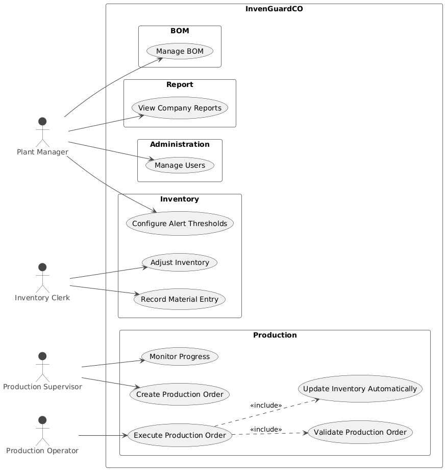
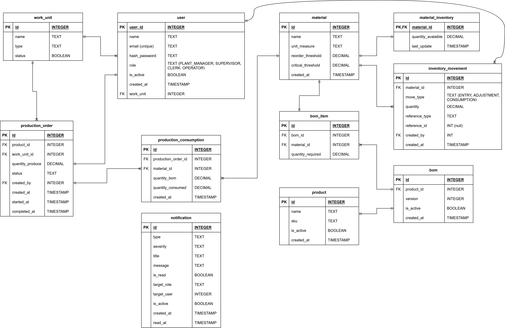

# InvenGuardCO

*Inventory Management System for Manufacturing Environments*

## Context 

Alimentos del Valle S.A. (fictional case) is a medium-sized Colombian company dedicated to the production and distribution of packaged food products such as cookies and snacks.
The company operates multiple production lines and relies on a continuous availability of raw materials (e.g., flour, sugar, packaging materials) to maintain uninterrupted operations.

Currently, inventory management is performed manually, resulting in limited visibility of stock levels, lack of consumption traceability, and delayed replenishment decisions. These limitations increase the risk of material shortages and excess inventory, negatively impacting operational efficiency and production continuity.

> [!NOTE]
> This project models a fictional but realistic industrial scenario inspired by common challenges in manufacturing environments.

## Problem Statement

The company lacks a centralized and reliable inventory management system capable of accurately tracking raw material consumption and availability. As a result:

- Inventory levels are not updated in real time.
- Material consumption during production is not consistently recorded.
- Replenishment decisions are reactive rather than proactive.
- Production lines are exposed to interruptions caused by unexpected stockouts.
- This situation leads to operational inefficiencies, increased costs, and reduced production reliability.

## Proposed Solution

To address these challenges, the development of a software system named InvenGuardCO is proposed.
The system aims to provide operational visibility and decision support through the following core capabilities:

1. **Real-time inventory tracking**: Maintain up-to-date stock levels of raw materials based on inventory movements, including material entries and consumption during production.

2. **Bill of Materials (BOM) management**: Define production recipes that specify the required quantities of raw materials per finished product.

3. **Production feasibility validation**: Validate whether a production order can be executed with the currently available inventory before committing any stock changes.

4. **Automated inventory updates**: Upon production execution, automatically register material consumption and update inventory records consistently.

5. **Low-stock alerts**: Generate alerts when inventory levels fall below predefined thresholds, enabling proactive replenishment decisions.

## General Objective
Design and develop a software system that supports production decision-making by ensuring material availability, preventing unexpected stockouts, and improving inventory control in a manufacturing environment.

## Scope

<strong>Included in scope</strong>

- Development of core inventory management functionalities.
- Implementation of production feasibility checks based on real-time inventory data.
- Integration of alert mechanisms for low-stock situations.
- User interface for managing inventory, production orders, and BOM's.

<strong>Out of scope</strong>

- Integration with external ERP systems.
- Advanced forecasting or demand planning functionalities.
- Physical inventory counting processes.
- Supplier management. For now, the system doesn't include situations involving the receipt of materials from actual suppliers; this is simulated manually.

## Actors 

For define well the system requirements, the following actors have been identified:

| Actor | Responsibilities |
|-------|------------------|
| **Plant Manager** | Create and manage users, define raw materials, products, and BOM's, oversee overall inventory management and define alert stock thresholds. |
| **Production Supervisor** | Create and manage production orders (assign production orders to lines) and monitor production progress. |
| **Inventory Clerk** | Record material entries and adjustments, monitor inventory levels, and respond to low-stock alerts. |
| **Production Operator** | Execute production orders and record issues and status of the production process. |

## Requirements

You can find the complete list of requirements in the [requirements.md](requirements.md) file.

## Use Cases

  

## E-R Diagram

The analysis of the requirements led to the definition of the business entities and their relationships, which are represented in the following E-R diagram:

  

